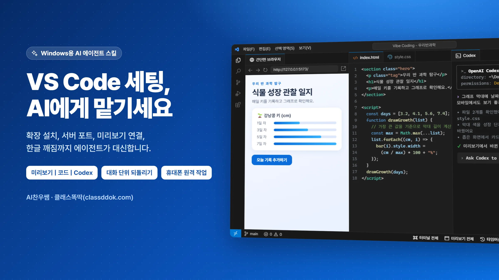
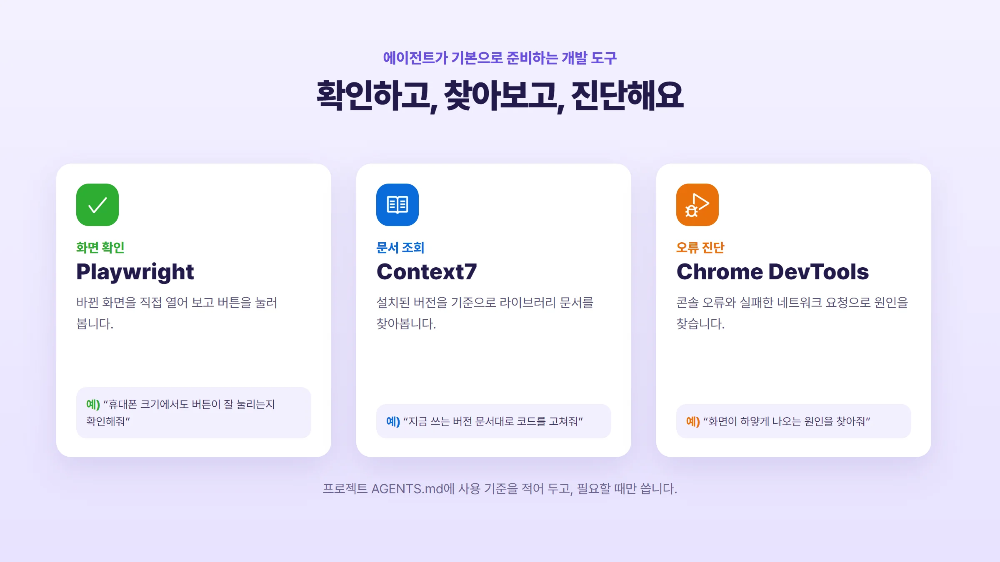
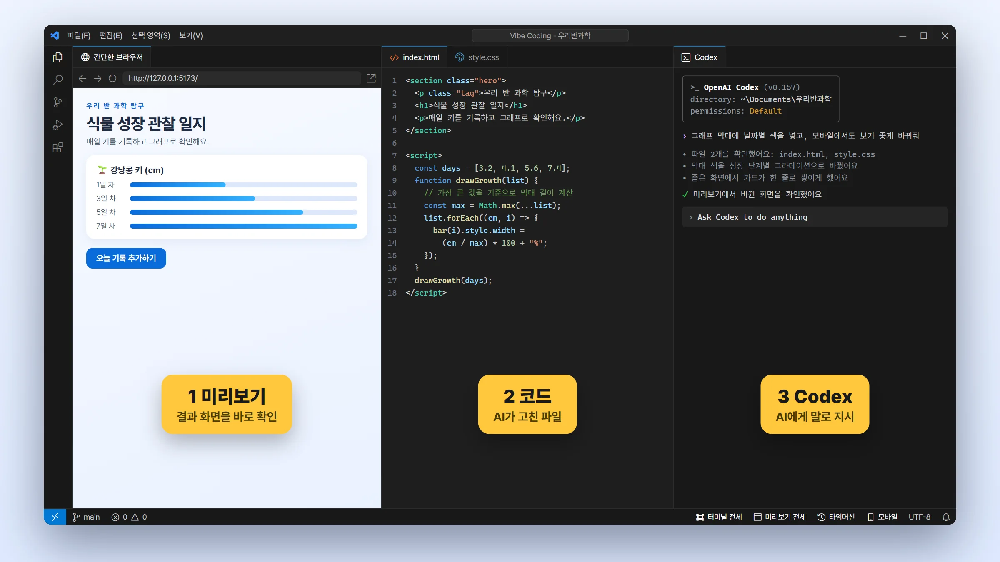
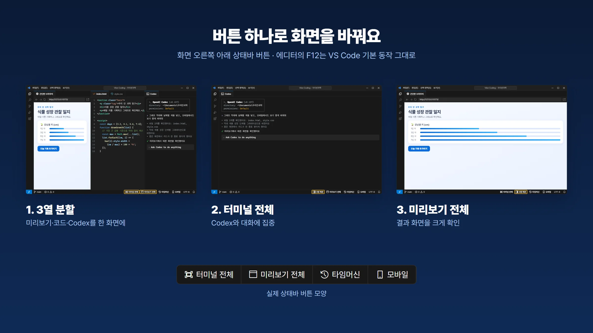
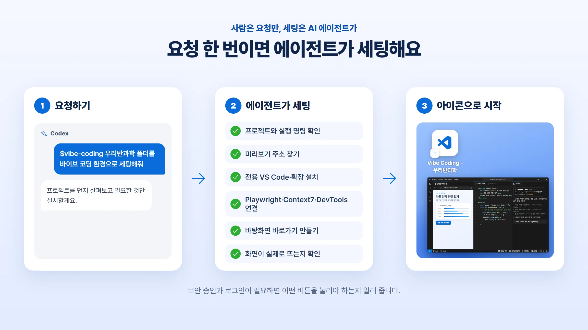
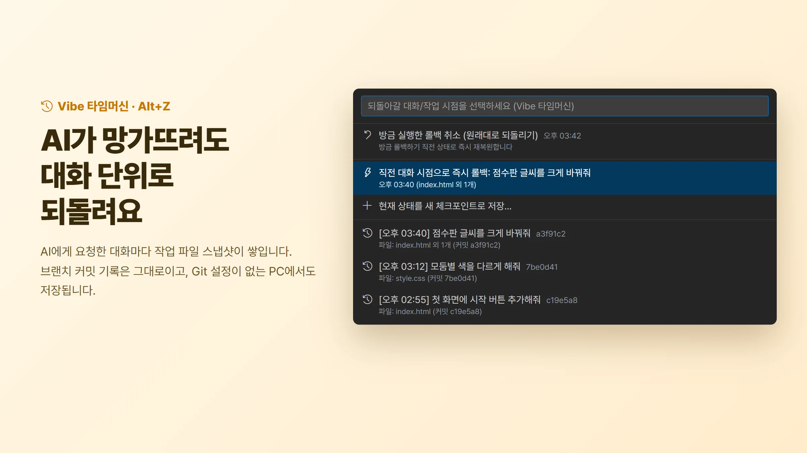
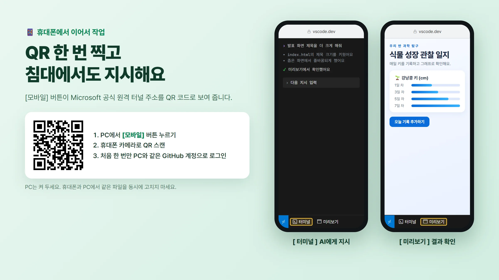
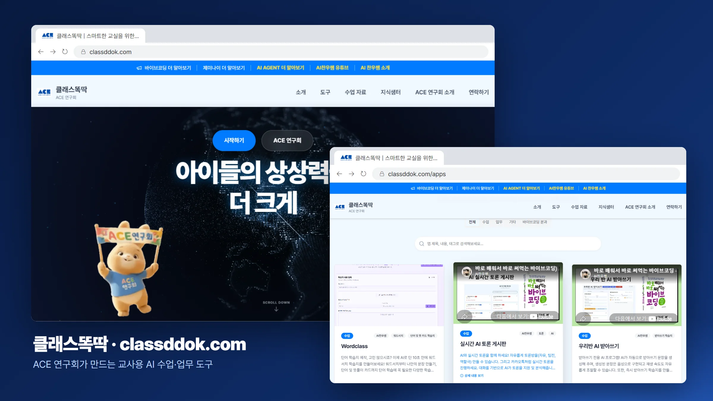

# Vibe Coding

[](https://github.com/ARTHONG1/vsstudiovibecoding/releases)
[](LICENSE)
[](https://github.com/ARTHONG1/vsstudiovibecoding)
[](https://github.com/ARTHONG1/vsstudiovibecoding/actions)

**VS Code 세팅을 AI 에이전트에게 통째로 맡기는 Windows·macOS용 바이브 코딩 스킬.**

> Let an AI agent set up your whole VS Code vibe-coding workspace on Windows or macOS: preview, code, and Codex side by side, plus one-tap mobile access.

**[바로 시작하기](#가장-쉬운-시작)** · [English](README.en.md) · [소개 페이지](https://arthong1.github.io/vsstudiovibecoding/) · [공유 문구](SHARING.md) · [사용 후기 / 아이디어](https://github.com/ARTHONG1/vsstudiovibecoding/issues/new/choose)

### 35초로 보는 Vibe Coding

https://github.com/user-attachments/assets/05ad2995-62e7-4ae0-baa9-389ecaa69941

[고화질 영상과 시작 안내](https://arthong1.github.io/vsstudiovibecoding/#intro-video) · [최신 스킬 다운로드](https://github.com/ARTHONG1/vsstudiovibecoding/releases/latest) · [AI가 읽는 요약](https://arthong1.github.io/vsstudiovibecoding/llms.txt)

만든 사람 **AI찬우쌤** · [클래스똑딱(classddok.com)](https://classddok.com/) · [유튜브](https://www.youtube.com/channel/UCnmcRReKbadpjJmueG1nzvw)

써보고 도움이 됐다면 저장소 오른쪽 위 **Star**로 보관하거나, [공유 문구](SHARING.md)를 가져가 소개해주세요. 실제 사용 경험은 다음 개선에 도움이 됩니다.



바이브 코딩을 시작할 때 진짜 어려운 건 코드가 아니라 **환경**입니다. 어떤 확장을 깔아야 하는지, 개발 서버 포트는 몇 번인지, 미리보기를 어디에 붙여야 하는지, 터미널 한글은 왜 깨지는지. 이 스킬은 그 과정을 사람이 배우게 하지 않고 **AI 에이전트에게 위임합니다.**

한 문장만 던지면 에이전트가 프로젝트를 열어 구조를 읽고, 실행 명령과 미리보기 주소를 직접 찾아내고, 기존 VS Code와 분리된 전용 작업 환경을 만들고, 바탕화면 바로가기(맥은 실행 앱)까지 만든 뒤 화면이 실제로 뜨는지 확인합니다. 필요한 로그인·프로젝트 신뢰 승인은 사용자가 확인합니다.

v2.9.0부터 **맥(macOS)**에서도 같은 환경을 세팅합니다(베타). 휴대폰 연결 QR이 일부 PC에서 인식되지 않던 문제도 고쳤습니다. 자동 검증과 실제 기기 검증 범위는 [TESTING.md](TESTING.md)에 구분해 기록합니다.

### 기본 AI 작업 도구 — 기본 도구 세팅



전체 환경 세팅을 맡은 AI 에이전트는 **Playwright CLI + 공식 Skill, Context7 MCP, Chrome DevTools MCP**를 기본으로 설치·연결합니다. 이미 정상 작동하면 재사용하고, 실제 VS Code의 Codex에서 사용할 수 있는지 확인합니다. 화면 동작 확인, 필요한 라이브러리 문서 조회, 브라우저 오류 진단에 적절히 쓰도록 프로젝트의 `AGENTS.md` 또는 연결된 지침도 보존·보완합니다. 모든 작업에 세 도구를 강제로 실행하지는 않습니다.

이 절차는 [스킬의 도구 세팅 지침](vibe-coding/references/agent-tools.md)을 읽은 **AI 에이전트가 수행**합니다. `setup.ps1`·`setup-macos.sh`나 VS Code 확장만 실행해서는 설치되지 않습니다. Node·브라우저 설치, 외부 문서 서비스의 인증/호출 제한, Codex 프로젝트 신뢰에 따라 일부 단계가 대기할 수 있으며 설치·클라이언트 인식·실제 호출을 구분해 보고합니다.

열리는 화면은 왼쪽 **미리보기**, 가운데 **코드**, 오른쪽 **Codex** 세 칸입니다. 상태바 버튼으로 [3열 분할] ↔ [터미널 전체] ↔ [미리보기 전체]를 오가고, [📱 모바일]로 휴대폰에서 같은 프로젝트를 이어서 작업합니다. 작업 중에는 대화 단위로 스냅샷이 쌓여 원하는 과거 시점으로 되돌릴 수 있습니다. 에디터의 `F12`는 VS Code 기본 동작(정의로 이동) 그대로 둡니다.





**[친절한 시작 안내 →](https://arthong1.github.io/vsstudiovibecoding/)** · **[스킬 ZIP 다운로드](https://github.com/ARTHONG1/vsstudiovibecoding/releases/download/v2.9.0/vibe-coding-2.9.0.zip)** · [문제 신고](https://github.com/ARTHONG1/vsstudiovibecoding/issues)

## 가장 쉬운 시작



로컬 파일과 프로그램을 다룰 수 있는 AI 에이전트에 아래 문장을 붙여 넣으세요. 일반 웹 채팅만으로는 PC 설정을 변경할 수 없습니다.

```text
https://github.com/ARTHONG1/vsstudiovibecoding 의 vibe-coding 폴더를
내 AI 도구의 스킬 폴더에 설치하고 SKILL.md를 읽어 실행해줘.
내 컴퓨터(Windows 또는 macOS)에 별도 샘플 프로젝트를 만들고 VS Code, Codex CLI,
필수 확장, 미리보기 | 코드 | Codex 3열 화면과 상태바 토글 버튼까지 설정해줘.
Playwright·Context7·Chrome DevTools 세 가지를 기본 준비하고,
Codex에서의 사용 가능 여부와 프로젝트의 도구 사용 지침도 확인해줘.
기존 설정과 파일은 보존하고 실제 화면, 버튼, 3대 모드 전환,
바탕화면 실행 아이콘 재실행을 검증해줘. 보안 승인과 로그인이 필요하면
정확히 어떤 버튼을 내가 눌러야 하는지 알려줘.
```

에이전트가 스킬을 새로 인식하려면 새 대화나 앱 재시작이 필요할 수 있습니다. 설치 후에는 `$vibe-coding 환경 처음부터 끝까지 세팅해줘`라고 요청하세요. 도구마다 스킬 지원 방식이 다릅니다.

### ZIP으로 직접 설치할 때

1. 위 스킬 ZIP을 받아 압축을 풉니다. 안에 `vibe-coding/SKILL.md`가 있어야 합니다.
2. Codex의 경우 `vibe-coding` 폴더 전체를 Windows는 `%USERPROFILE%\.agents\skills\` (또는 기존 `%USERPROFILE%\.codex\skills\`), 맥은 `~/.agents/skills/` (또는 `~/.codex/skills/`) 아래에 둡니다. 동명의 스킬이 있으면 기존 폴더를 먼저 백업하세요.
3. 새 대화를 열고 `$vibe-coding 환경 처음부터 끝까지 세팅해줘`를 입력합니다.

`SKILL.md` 하나만 복사하면 안 됩니다. `scripts`, `assets`, `references`가 함께 필요합니다. 스킬을 설치하는 단계와 PC 개발 환경을 설정하는 단계는 별개입니다.

### 맥(macOS)에서 쓸 때 (베타)

v2.9.0부터 같은 요청문으로 맥에서도 세팅합니다. 에이전트는 `setup-macos.sh`로 `~/Library/VibeCoding`에 전용 환경을 만들고, 바탕화면에 **Vibe Coding - 프로젝트명-식별자.app** 실행 앱을 만듭니다. 이 앱을 더블클릭하면 같은 3열 화면이 열립니다.

맥에서는 아래 단계를 사용자가 직접 처리합니다.

- **개발자 도구 설치:** Git이 없으면 맥이 명령어 라인 개발자 도구(Command Line Tools) 설치 창을 띄웁니다. [설치]를 누르고 끝날 때까지 기다리세요. 타임머신에 필요합니다.
- **맥 암호:** VS Code나 Node.js를 설치할 때 맥 로그인 암호를 물을 수 있습니다.
- **폴더 접근 허용:** 프로젝트가 문서·데스크탑 폴더에 있으면 Codex 앱이나 VS Code가 접근을 묻습니다. [허용]을 누르세요.
- **화면 확인 권한:** 에이전트가 화면을 확인하려면 시스템 설정 → 개인정보 보호 및 보안의 화면 기록과 손쉬운 사용에서 AI 앱을 허용해야 합니다.

단축키는 맥 방식을 그대로 씁니다. 복사·붙여넣기는 `⌘C`/`⌘V`, 타임머신은 `⌥Z`, 캡처 이미지 붙여넣기는 `⌥V`입니다.

맥 지원은 GitHub의 깨끗한 맥 가상 컴퓨터(Apple silicon)에서 매 변경마다 자동 검증합니다. 공식 VS Code·Codex CLI 설치, 세팅 적용과 재적용, 바탕화면 실행 앱으로 3열 화면 열기, Codex 실행, 타임머신 저장, 캡처 이미지 붙여넣기, 터널 실행 파일 확인까지 확인합니다. 실제 사용자 맥북에서의 확인과 맥에서 휴대폰 연결은 아직 검증 대기입니다. 맥에서 막히면 [이슈](https://github.com/ARTHONG1/vsstudiovibecoding/issues/new/choose)로 알려주세요.

## 준비물과 지원 범위

| 항목 | 안내 |
|---|---|
| PC | Windows, macOS(베타). Windows는 Windows 11 x64에서 실제 사용을 검증했고, macOS는 GitHub의 맥 가상 컴퓨터(Apple silicon)에서 설치와 실행을 자동 검증합니다. Linux는 지원하지 않습니다. |
| AI 도구 | 로컬 파일·셸 실행 권한. 화면 검증에는 화면 제어 도구도 필요합니다(맥은 화면 기록·손쉬운 사용 권한). |
| 인터넷 | VS Code 및 확장 다운로드, Codex CLI 사용에 필요합니다. 학교·회사 네트워크 정책에 따라 차단될 수 있습니다. |
| Codex | OpenAI 공식 Codex CLI(Windows `codex.exe` / `codex.cmd`, 맥 `codex`)를 3열 에이전트 터미널로 구동합니다. |
| AI 사용 | 선택한 제공자의 로그인/API 키가 필요할 수 있고 요금·사용 한도가 다릅니다. 환경 설정이 AI 이용권을 제공하지 않습니다. |
| 프로젝트 | 처음에는 샘플 권장. 기존 HTML·React/Vite 등은 원래 파일과 개발 서버를 유지합니다. |

## 내가 직접 할 수밖에 없는 단계

- **작업 영역 신뢰:** 직접 만든 샘플이나 출처를 아는 프로젝트인지 확인합니다. VS Code가 "이 작업 영역에 있는 파일의 작성자를 신뢰합니까?"라고 물으면 **[예, 작성자를 신뢰합니다]**를 선택하고, 이미 닫았다면 위쪽 `제한 모드` 알림줄의 **[관리] → [신뢰]**를 누릅니다. 모든 폴더를 일괄 신뢰하거나 보안을 끄지 마세요.
- **Codex 폴더 신뢰:** 오른쪽 Codex가 이 폴더를 신뢰할지 물으면 직접 선택합니다. 신뢰해야 프로젝트에 설정된 Context7·Chrome DevTools가 켜집니다.
- **도구의 앱 제어 승인:** 에이전트가 VS Code를 볼 수 있도록 도구가 요청하는 승인을 확인합니다.
- **AI 로그인:** Codex CLI 실행 시 인증 요구사항을 확인합니다. 계정·비밀번호·키는 공개 이슈나 채팅에 붙여 넣지 마세요.

보안·로그인 화면은 자동화 도구의 규칙에 따라 사용자가 직접 처리해야 합니다. 완료 후 “진행해”라고 말하면 나머지는 에이전트가 이어갑니다.

## 정상 완료의 기준

1. 왼쪽은 작동하는 미리보기, 가운데는 실제 소스, 오른쪽은 Codex 입력창입니다.
2. 샘플의 **미리보기 작동 확인** 버튼을 누르면 클릭 횟수가 증가합니다.
3. 화면 우측 하단 상태바의 **[ 🗖 터미널 전체 ]** 클릭 시 Codex 터미널 100% 확대, **[ ⊞ 3열 복원 ]** 클릭 시 원래대로 복귀함을 확인합니다.
4. **[ 🌐 미리보기 전체 ]** 클릭 시 웹 미리보기 100% 확대(Computer Use / 1:1 검수용), **[ ⊞ 3열 복원 ]** 클릭 시 50:50 분할 복귀를 확인합니다.
5. 에디터에서 `F12`를 눌렀을 때 터미널이 가로채지 않고 순정 **[함수/변수 정의로 이동]**이 정상 작동함을 확인합니다.
6. 생성된 **Vibe Coding - 프로젝트명-식별자** 바탕화면 바로가기(맥은 실행 앱) 또는 윈도우 탐색기 폴더 우클릭 **[ Vibe Coding으로 열기 ]**(등록한 경우)로 다시 열어도 의도한 프로젝트와 화면 배치가 복원되는지 확인합니다.
7. 코드 에디터 우측 상단 툴바의 **[ ↗ 외부 브라우저에서 열기 ]** 클릭 시 시스템 기본 브라우저(Chrome/Edge)가 뜨며 순정 F12 개발자 도구(Network, Application/쿠키) 및 실시간 디버깅이 연결됨을 확인합니다.
8. 터미널에서 `Ctrl+V`(맥 `⌘V`)로 클립보드 텍스트가 즉시 붙여넣어지고 마우스 선택 시 자동 복사되며, `Alt+V`(맥 `⌥V`, 또는 상단 📷 아이콘)로 클립보드 캡처 이미지가 파일로 자동 저장되어 터미널에 경로가 즉시 입력됨을 확인합니다.
9. 세 가지 기본 도구의 설치·실제 Codex 인식·호출 결과와 프로젝트 사용 지침을 확인합니다. 인증·신뢰·새 세션이 필요하면 해당 도구를 미완료로 표시하고 정확한 다음 단계를 안내합니다.

설치 성공 로그만으로 완료로 판단하지 않습니다. 화면 도구가 없으면 화면 검증은 미완료로 표시합니다. Codex 입력창 표시와 실제 인증된 AI 응답도 구분합니다.

## 막혔을 때

| 증상 | 확인할 것 / 에이전트에게 할 요청 |
|---|---|
| 빈 화면, 기본 Chat만 보임 | 시작 안내를 완료했는지와 위쪽 `제한 모드` 알림줄이 있는지 먼저 확인. “현재 화면과 확장 활성화 로그를 확인해줘.” |
| 제한 모드 | 출처를 확인한 프로젝트만 신뢰. 위쪽 알림줄의 [관리] → [신뢰]를 직접 누른 뒤 “진행해”. 제한 모드에서는 Vibe 버튼과 미리보기가 작동하지 않습니다. |
| Codex를 찾지 못함 | 공식 Codex CLI 설치 확인 또는 npm fallback 확인. “codex의 경로와 --version을 확인해줘.” |
| 맥에서 개발자 도구 설치 창이 뜸 | 타임머신에 쓰는 Git이 아직 없습니다. [설치]를 누르고 끝나면 “진행해”. |
| 맥에서 폴더 접근을 물어봄 | 문서·데스크탑 폴더의 프로젝트를 열 때 나오는 정상 확인입니다. [허용]을 누르세요. |
| 오른쪽이 너무 좁음 | 패널 경계선을 왼쪽으로 이동. “Codex 입력창이 잘 보이도록 너비를 조정해줘.” |
| 상태바 버튼이 안 보임 | 먼저 위쪽 `제한 모드` 알림줄 확인(제한 모드에서는 버튼이 나타나지 않습니다). 신뢰한 뒤 화면 우측 하단 확인. 그래도 없으면 창 다시 로드(`Ctrl+Shift+P`, 맥 `⌘⇧P` → `창 다시 로드`) 실행. |
| 미리보기 복원 시간 초과 | 개발 서버가 실제로 응답하는지 먼저 확인. "업데이트 후 저장하지 않은 파일을 보존하고 전용 창을 다시 열어 검증해줘." |
| 휴대폰에서 폴더가 열리지 않음 | 한글·공백 경로는 주소에 그대로 담기지 않습니다. [📱 모바일] QR은 영문 경로의 `.code-workspace`를 대상으로 해야 합니다. |
| 휴대폰에 버튼이 안 보임 | 원격 서버에도 Vibe 확장이 설치돼야 합니다. 페이지를 새로고침한 뒤 상태바 왼쪽의 [터미널] · [미리보기]를 확인하세요. |
| 실행 정책/조직 정책 오류 | 정책을 끄거나 우회하지 않음. 에이전트가 허용된 실행 경로를 확인; 관리 조직 정책이면 관리자 문의. |
| 빈 index.html 또는 경로 불일치 | 앱 가상화 가능성. “실제 Windows 사용자와 에이전트의 파일 해시·경로를 비교해줘.” |
| React/Vite 미리보기 연결 실패 | 기존 개발 서버가 실행 중인지와 실제 localhost URL 확인. HTML 샘플로 덮어쓰지 않음. |
| AI 응답이 없음 | Codex CLI의 로그인/인증 상태·한도·네트워크 확인. |

문제 신고에는 OS, 버전, 기대/실제 동작, 민감정보를 가린 오류만 포함하세요. 전체 로그나 사용자 경로·API 키를 그대로 게시하지 마세요.

## ⏪ Vibe 타임머신 (대화 단위 되돌리기)



AI가 코드를 고치다 멀쩡하던 기능을 망가뜨렸을 때, 대화 턴 단위로 과거 시점을 골라 작업 파일을 되돌립니다. 초보자가 Git 명령을 배우지 않아도 "아까 그 상태로"가 가능하도록 만든 장치입니다.

- **브랜치 기록을 건드리지 않음**: `git commit`이나 `git stash` 대신 저수준 명령(`commit-tree`)으로 별도 스냅샷을 만들고 `refs/vibe` 아래에 보관합니다. main 브랜치 커밋 로그에는 아무것도 추가되지 않습니다. 스냅샷 객체 자체는 프로젝트의 `.git` 안에 저장됩니다.
- **Staging 보존**: 복원할 때 별도 인덱스를 사용하므로, 사용자가 `git add`로 올려둔 상태는 그대로 남습니다.
- **Git 설정 없이 작동**: 스냅샷은 `Vibe Coding Time Machine`이라는 전용 작성자 정보로 저장합니다. Git 사용자 이름·이메일을 설정하지 않은 PC에서도 저장되며, 사용자의 Git 설정 파일은 바꾸지 않습니다.
- **대화 제목으로 기록**: "응", "진행해" 같은 단답은 걸러내고 실제 지시 내용(예: *"점수판 텍스트를 한글로 바꿔줘"*)을 스냅샷 이름으로 대화당 하나씩 남깁니다.
- **되돌리기와 취소**: 에디터 툴바의 **[ ⏪ ]** 또는 상태바 **[ 타임머신 ]**(`Alt+Z`, 맥 `⌥Z`)으로 복원 메뉴를 열고, 방금 한 롤백을 다시 취소할 수 있습니다.

## 저장 위치·업데이트·되돌리기

전용 환경은 Windows는 `%LOCALAPPDATA%\VibeCoding`, 맥은 `~/Library/VibeCoding` 아래의 `VSCodeUserData`, `VSCodeExtensions`, `Workspaces`, `Backups`에 저장됩니다. 샘플은 `SampleProject`입니다. 기존 프로젝트는 이동하지 않습니다.

업데이트할 때 기존 스킬을 백업하고 새 폴더로 바꾼 뒤 에이전트에게 재설정을 요청합니다. 전용 설정의 관리 키만 병합하고 기존 파일을 보존합니다. Vibe가 만들지 않은 터미널과 에디터 탭은 닫지 않습니다.

## 하이브리드 브라우저 & AI 디버깅 파이프라인

- **가벼운 실시간 코딩:** VS Code 3열 내장 뷰포트로 리소스 낭비 없이 실시간 핫리로드 반영
- **AI 시각 검수 (Computer Use):** `[ 🌐 미리보기 전체 ]` 모드로 에디터 요소를 걷어낸 1:1 뷰포트 확보
- **결제·쿠키·F12 심층 검수:** 코드 상단 툴바의 `[ ↗ 외부 브라우저 ]` 클릭 한 번으로 Chrome/Edge 호출
- **AI 초고속 DOM 검증:** 프로젝트의 실제 로컬 개발 서버(Live Preview 또는 Vite 5173, Next.js 3000 등) 엔드포인트를 상시 유지하여 Playwright/Browser-Use가 백그라운드 CDP로 결제창·모달·네트워크 무결성 테스트 병행

## 개발자 / 직접 실행

에이전트용 스크립트입니다. 일반 사용자는 위 요청문으로 시작하세요.

```powershell
# 계획만 확인 (파일을 변경하지 않음)
& .\vibe-coding\scripts\setup.ps1 -CreateSample
# 계획을 확인한 뒤 적용
& .\vibe-coding\scripts\setup.ps1 -CreateSample -Apply
# 기존 HTML 프로젝트
& .\vibe-coding\scripts\setup.ps1 -ProjectPath 'C:\Projects\My Site' -EntryFile index.html -Apply
```

```sh
# macOS: 계획만 확인 → 적용 → 기존 프로젝트
sh vibe-coding/scripts/setup-macos.sh --create-sample
sh vibe-coding/scripts/setup-macos.sh --create-sample --apply
sh vibe-coding/scripts/setup-macos.sh --project ~/Projects/my-site --entry index.html --apply
```

설치 스크립트는 공식 OpenAI Codex CLI를 탐색하여 3열 터미널을 구성합니다. 프레임워크 개발 서버는 `.vscode/tasks.json` 백그라운드 태스크로 자동 실행을 소유하여 포트 충돌 없이 구동됩니다.

 `npm test`로 회귀 테스트, `npm run check`로 패키지·문서 링크 검사, Windows의 `powershell -File scripts/build-release.ps1`로 배포 ZIP을 만듭니다.

## 검증 기록

2026-09-18, Windows 11 x64 / VS Code 1.138.0 / Codex CLI / Live Preview 0.4.20에서 샘플 3열·한글·버튼·F12 왕복·정상 종료/재실행과 미리보기 제목 변경 수정 후 복원을 실제 화면 및 로그로 확인했습니다. macOS는 GitHub의 깨끗한 맥 가상 컴퓨터(Apple silicon)에서 공식 VS Code·Codex CLI를 설치하고, 샘플 세팅, 바탕화면 실행 앱 열기, 3열 화면, Codex 실행, 타임머신까지 매 변경마다 자동 검증합니다. 다른 PC와 모든 프레임워크에서 성공을 보장하는 결과는 아닙니다. [검증 범위](TESTING.md)를 확인하세요.

## 휴대폰에서 원격으로 작업하기



상태바 **[📱 모바일]** 버튼을 누르면 마이크로소프트 공식 `code tunnel` 엔진이 백그라운드에서 프로젝트 전용 `vscode.dev` 주소를 만들고, **스마트폰 카메라로 바로 스캔할 수 있는 QR 코드**를 띄웁니다. 휴대폰에서 최초 1회 PC와 같은 GitHub 계정으로 로그인하면 내 PC의 프로젝트가 그대로 열립니다.

휴대폰 화면에서는 상태바 왼쪽에 **[ 터미널 ]** 과 **[ 미리보기 ]** 두 버튼만 크게 노출됩니다. [터미널]은 Codex 입력 화면으로, [미리보기]는 Private 개발 서버의 결과를 별도 브라우저 탭으로 엽니다. 작업을 계속하려면 VS Code 탭으로 돌아옵니다. 좁은 화면에서 3열을 거치지 않으므로 이동 중에도 바로 지시하고 결과를 확인할 수 있습니다.

연결 주소는 한글·공백이 없는 `.code-workspace` 파일을 가리킵니다. `vscode.dev`가 주소에 담긴 한글을 그대로 폴더 이름으로 취급해 프로젝트가 열리지 않던 문제를 피하기 위해서입니다. 워크스페이스 파일이 프로젝트 폴더와 미리보기 주소를 함께 담고 있어 휴대폰에서도 같은 설정이 적용됩니다.

PC가 켜져 있고 온라인이어야 하며, `--no-sleep` 플래그로 터널 동작 중 절전이 방지됩니다. 맥북은 덮개를 닫으면 잠자기에 들어가 연결이 끊깁니다. 원격 창에도 Vibe 확장이 설치돼야 두 버튼이 보입니다. 휴대폰과 PC에서 같은 파일을 동시에 편집하지 마세요.

[AI의 모바일 설정 절차](vibe-coding/references/mobile-remote.md) · [VS Code 원격 터널 공식 문서](https://code.visualstudio.com/docs/remote/tunnels)

모바일 미리보기는 PC 개발 서버를 Private HTTPS 주소로 전달합니다. 기본 원격 주소가 localhost로 남으면 확장이 Microsoft CLI의 포트 전달을 준비합니다. 최초 미리보기 인증은 vscode.dev 로그인과 별도로 필요할 수 있습니다. Private 연결은 매번 별도 브라우저 탭으로 열어 인증과 앱 화면을 표시합니다. 앱의 iframe 정책이나 브라우저 쿠키 제한에 따라 외부 브라우저에서 확인해야 할 수 있습니다. 연결 주소 발급과 실제 휴대폰 화면 검증은 별개입니다.

## 만든 사람


**AI찬우쌤**은 교실에서 AI를 직접 쓰고 수업·업무 도구를 만드는 현직 초등 교사입니다. 수업 자료를 직접 만들다 보면 코드보다 환경 설정에서 먼저 막히는데, 그 벽을 학생과 선생님 대신 AI가 넘어주게 하자는 생각에서 이 스킬을 만들었습니다. 『바로 배워서 바로 써먹는 바이브 코딩』과 『바로 배워서 바로 써먹는 AI 에이전트』를 함께 쓴 공동 저자이기도 합니다.

- **클래스똑딱** — [classddok.com](https://classddok.com/) · AI찬우쌤이 운영하는 교사 연구회 ACE 연구회의 에듀테크 도구 모음입니다. AI 워드서치 학습지, 우리 반 AI 받아쓰기, 실시간 AI 토론 게시판, AI 퀴즈 제작, OMR 자동 채점, AI 품의서 생성기 등을 설치 없이 웹에서 바로 쓸 수 있고 [교원 연수(지식샘터)](https://classddok.com/trainings)도 운영합니다.
- **AI찬우쌤 유튜브** — [채널 바로가기](https://www.youtube.com/channel/UCnmcRReKbadpjJmueG1nzvw) · AI 도구를 수업에 실제로 적용하는 과정을 다룹니다.



교실이든 개인 프로젝트든, 환경 설정 때문에 시작을 미루는 사람이 줄어들면 좋겠습니다. 써보고 막히는 지점이 있으면 [이슈](https://github.com/ARTHONG1/vsstudiovibecoding/issues)로 알려주세요.

모바일 미리보기는 프로젝트의 실제 HTTP 서버 주소가 필요합니다. 재설정 시 저장된 주소를 유지하며, 작업 공간 주소가 비어 있으면 해당 프로젝트의 저장 설정을 확인합니다. 서버가 없는 경우 AI가 실행 방법과 주소를 확인해야 합니다.
